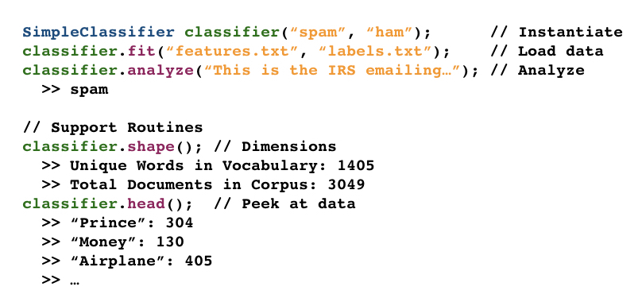
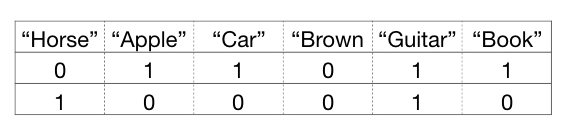
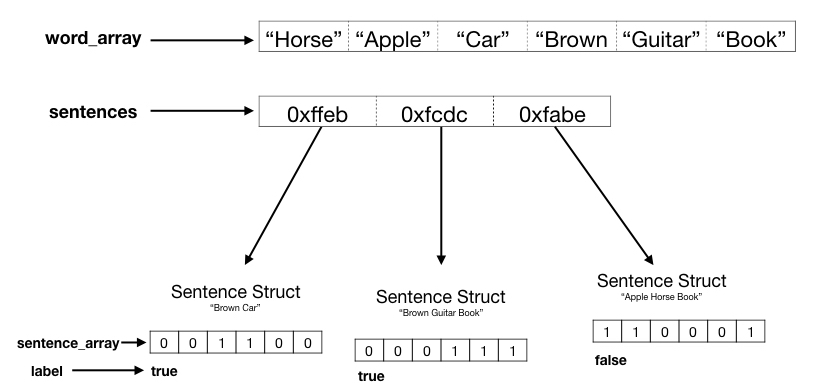
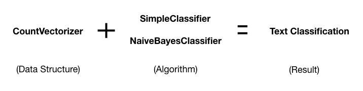
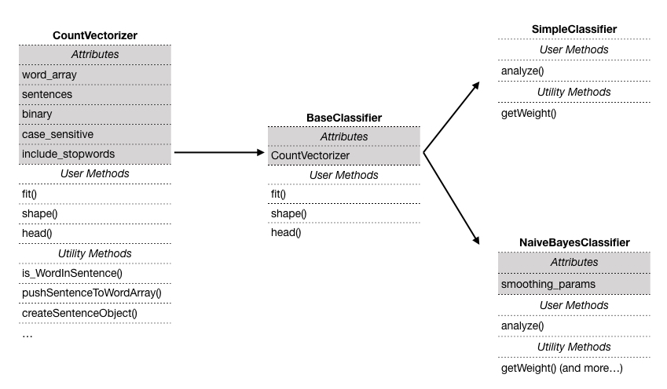
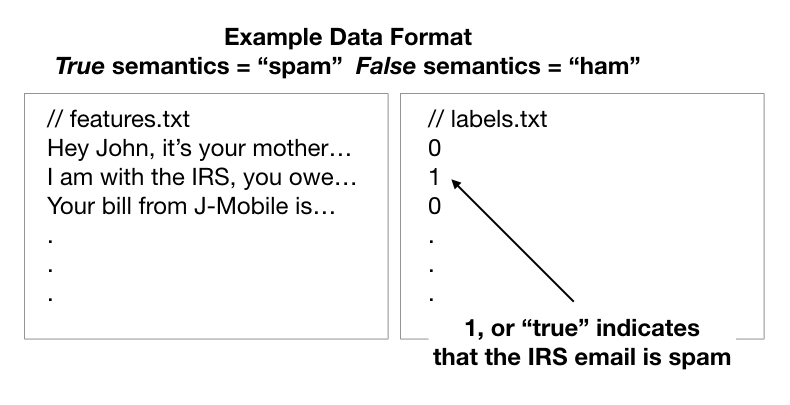

# Text Classification with CountVectorizer

## Project Goals
1. To creatively implement a general-purpose text classifier
2. To write code with sound object-oriented design
3. To learn TDD

## Project Overview:

### Getting Started

Dependencies: cmake

To run on Linux/Mac:
1. Clone the repo
2. In the project directory, I recommend creating a build folder: ```mkdir build```
3. Run ```cd build```
4. Run ```cmake ..```
5. Finally, run ```make```

### Usage



### What is a CountVectorizer?
A CountVectorizer is an text-storage data structure from the popular ML library Scikit Learn. In their words, a CountVectorizer:  "Converts a collection of text documents to a matrix of token counts"  [source](https://scikit-learn.org/stable/modules/generated/sklearn.feature_extraction.text.CountVectorizer.html)

Conceptually, it looks something like this:



### How is it implemented?

My implementation has a word array as a header, and a vector of pointers to sentences:



### How can it be used for text classification?

The CountVectorizer readily pairs with any number of classification algorithms.  As of the time of this writing, two algorithms have been built: a simple weighted average classifier and a Bayesian classifier (inspired from scikit learn's NaiveBayes model). [source](https://scikit-learn.org/stable/modules/naive_bayes.html)



### How is the code structured?

The CountVectorizer is a standalone class that is only concerned with holding the data.  The classifiers inherit from a base classifier to reduce redundancy.



### A note on data

The training data must be in a specific format to be used in this library.  Two files, a "features" and "labels" file must be used as an input for the model to work.  The format is this:



#### NOTE: This is part of a dataset that was created for the Paper 'From Group to Individual Labels using Deep Features', Kotzias et. al,. KDD 2015